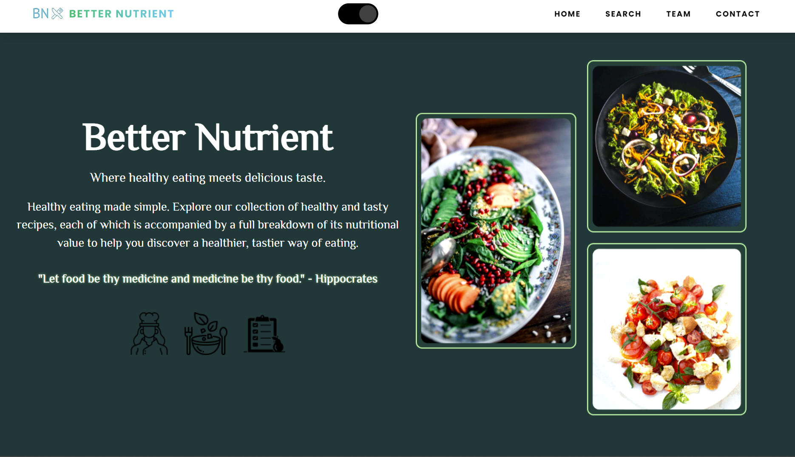

# Better Nutrient  🥗

## Table of contents

- [Overview](#overview)
  - [Objective](#objective)
  - [Screenshot](#screenshot)
  - [Links](#links)
- [Our process](#my-process)
  - [Built with](#built-with)
  - [What we learned](#what-i-learned)
  - [Continued development](#continued-development)
  - [Author](#author)
  - [Credits](#credits)

 

## Overview

Better Nutrient is a website that focuses on promoting healthy living. It provides users with the ability to search for a specific food of their choice, and in return, it displays the corresponding nutrients and recipe based on their input. This enables users to track their food intake to ensure they are obtaining the necessary nutrients they require daily.

### Objective

Our objective was to work together as a team to develop this web application, starting from the idea phase and continuing through to deployment. Our goal was to ensure that we had a minimum viable product that was ready for release.

 

## Screenshot

## Links

- Live Site URL: https://kingjessie.github.io/Better_Nutrient/
 

## Our process
We were required to find two different, functional, and free APIs and devise a strategy for incorporating them into our project. Numerous efforts were made with various concepts before we settled on recipes and nutritional values for healthy lifestyle and encourage healthy eating habits through our platform.

### Built with

- Semantic HTML5 markup
- CSS custom properties
- Javascript
- Jquery
- Flexbox
- Bootstrap
- Mobile-first workflow

 

## What we learned
For the most part the newest part of building this page was learning to work in a team, take on smaller pieces of the whole, the process of give and take, as well as learning new aspects of GitHub - project side, the board, switching branches, pushing to main and accepting other team members pull requests.
 

We've also learned the importance of collaborative learning and sharing of ideas to foster creativity. Through this process, we have challenged ourselves to continue our learning on integrating two different API's and retrieving information from the database to display on our web application.
 

## Continued development

For future development, our aim is to introduce a feature that provides users with healthy smoothie recipes to complement their healthy meal choices.
Additionally, we will include a health and wellness blog to provide users with informative and educational articles on healthy eating and wellness.
 

## Authors
Jessie Kinganga
- GitHub - [KingJessie](https://github.com/KingJessie)

Ebele Precious Okemba
- GitHub - [preshy59](https://github.com/preshy59)

Sophie Perks
- GitHub - [Sophie Senge](https://github.com/Sophie-Senge)

### Credits

- Image: Shaif Arfan
- Icons: Icons8

